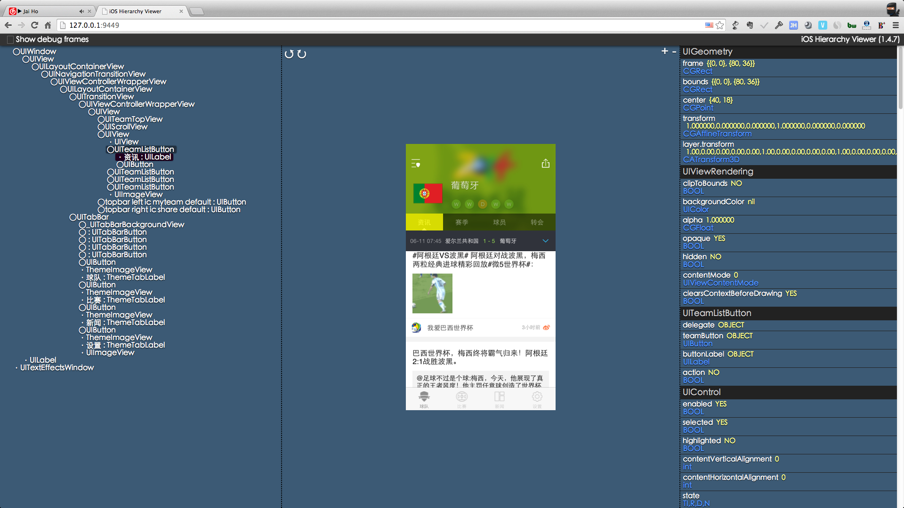
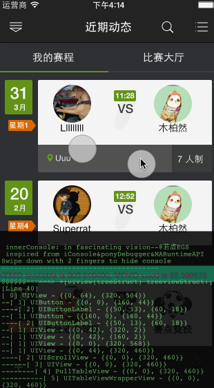

 
###insightTookit，Debug模式剖析App

1.  **app 界面层级信息查看**
	

2.  app 数据层信息索引查看

	思路同上。。。。O(∩_∩)O~  (关键是: 数据层dic arr 需要规划清晰才好dump 出来)

3.  innerConsole  内嵌控制台

	

4.  全局httpVerb swizzing截断获取
	
		+ (void)injectWillSendRequestIntoDelegateClass:(Class)cls;
	{
	    SEL selector = @selector(connection:willSendRequest:redirectResponse:);
	    SEL swizzledSelector = [self swizzledSelectorForSelector:selector];
	    
	    Protocol *protocol = @protocol(NSURLConnectionDataDelegate);
	    if (!protocol) {
	        protocol = @protocol(NSURLConnectionDelegate);
	    }
	    
	    struct objc_method_description methodDescription = protocol_getMethodDescription(protocol, selector, NO, YES);
	    
	    typedef NSURLRequest *(^NSURLConnectionWillSendRequestBlock)(id <NSURLConnectionDelegate> slf, NSURLConnection *connection, NSURLRequest *request, NSURLResponse *response);
	    
	    NSURLConnectionWillSendRequestBlock undefinedBlock = ^NSURLRequest *(id <NSURLConnectionDelegate> slf, NSURLConnection *connection, NSURLRequest *request, NSURLResponse *response) {
	        [self domainControllerSwizzleGuardForSwizzledObject:slf selector:selector implementationBlock:^{
	            [[swizzOnNSURLConnection defaultInstance] connection:connection willSendRequest:request redirectResponse:response];
	        }];
	        
	        return request;
	    };
	    
	    NSURLConnectionWillSendRequestBlock implementationBlock = ^NSURLRequest *(id <NSURLConnectionDelegate> slf, NSURLConnection *connection, NSURLRequest *request, NSURLResponse *response) {
	        NSURLRequest *returnValue = ((id(*)(id, SEL, id, id, id))objc_msgSend)(slf, swizzledSelector, connection, request, response);
	        undefinedBlock(slf, connection, request, response);
	        return returnValue;
	    };
	    
	    [self replaceImplementationOfSelector:selector withSelector:swizzledSelector forClass:cls withMethodDescription:methodDescription implementationBlock:implementationBlock undefinedBlock:undefinedBlock];
	}
	

5.  堆栈中的object graph in heap 绝对搜索定位
	
	[Beagle is an Objective C debugging tool that can sniff out class instances on the heap.]
	<https://github.com/heardrwt/RHObjectiveBeagle>
	
	[Simple NSObject-category wrapper for <objc/runtime.h>]
	<https://github.com/garnett/DLIntrospection>

6.  程序资源耗费可视化优化
	
	[Instrumentation for Objective C for debugging and profiling]
	<https://github.com/Cue/hookshot>
	
	
	$ bin/profile.py
	Using /Users/robbywalker/Library/Application Support/iPhone Simulator/6.0/Applications/C1FB13C1-C230-4435-8A10-F7BED5A6B475/Documents/profile-23274
	message                                                                              calls     ownTime       avgOwn      maxOwn         total
	AppDelegate.doSomethingExpensive                                                     27        562.433ms     20.8309ms   21.1630ms      562.433ms
	UIWebView.webView:decidePolicyForNavigationAction:request:frame:decisionListener:    2         19.480ms      9.7400ms    19.4440ms      20.110ms
	UIWebView._webViewCommonInitWithWebView:scalesPageToFit:shouldEnableReachability:    1         11.725ms      11.7250ms   11.7250ms      12.780ms
	AppDelegate.application:didFinishLaunchingWithOptions:                               1         7.913ms       7.9130ms    7.9130ms       25.179ms
	...
	

7.  封装好了的方便convincedMethod 4 swizzing

	[Delightful, simple library for aspect oriented programming.]
	<https://github.com/steipete/Aspects>
 

8. exploring obj-c-runtime ,feeling beauty Hierarchy 

	not stop....
